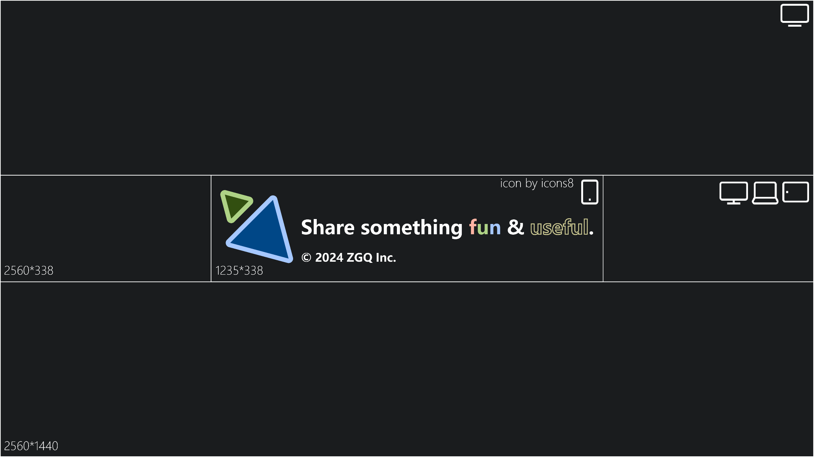

        

<!--  -->

<h2 align="center">个人主页</h2>

## [domain.zgqinc.gq](http://domain.zgqinc.gq/)

<!-- ## [我的资源群](https://archive.zgqinc.gq/transit-groups/)

### [安卓破解软件分享](https://zgqinc.gq/rtk_up)

`本人在软天空平台分享的2000个安卓破解软件`

### [资源列表](https://zgqinc.gq/resources)

`精选资源` -->

<h2 align="center">联系方式</h2>

<!---->

<!---->

<h2 align="center">个人TG频道</h2>

<!-- <h2 align="center">不活跃社区</h2>

在分享资源

[APP下载地址](https://zgq-inc.lanzouo.com/i8mAEwhcqgd) -->

<h2 align="center">访客数</h2>

<h2 align="center">Spotify正在播放</h2>

<h2 align="center">语言和工具</h2>

        
                                                     

<h2 align="center">个人Github成就</h2>

## [查看Github Skyline](https://skyline.zgqinc.gq/)

 

<h2 align="center">我在做的项目</h2>

| 网页 | Android |
|---|---|
|  |  |
|  |  Demo |
|  |  |
|  已停更 |  |
|  Demo | |
|  已停更 | |
|  Demo | |
