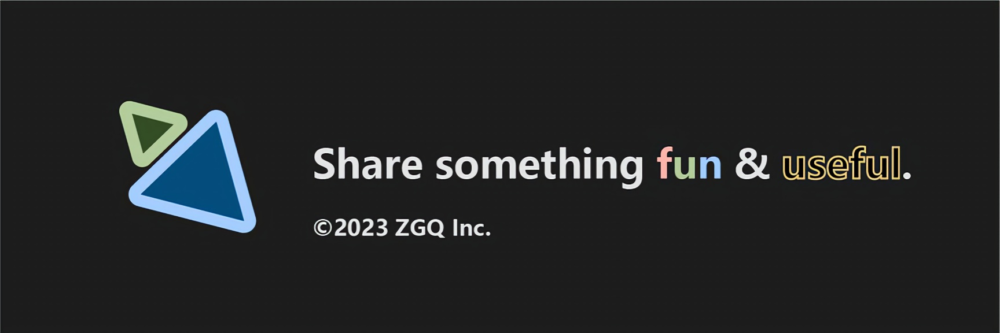

# [个人主页](http://domain.zgqinc.gq/)

# [我的资源群](https://archive.zgqinc.gq/transit-groups/)

# [安卓破解软件分享](https://zgqinc.gq/rtk_up)

`本人在软天空平台分享的2000个安卓破解软件`

# [资源列表](https://zgqinc.gq/resources)

`精选资源`

<h1 align="center">联系方式</h1>

<!---->

<h1 align="center">活跃社区</h1>

在分享资源

[APP下载地址](https://zgq-inc.lanzouo.com/i8mAEwhcqgd)

<h1 align="center">访客数</h1>

***

<h1 align="center">Spotify</h1>

***

<h1 align="center">个人Github成就</h1>

***

<h1 align="center">我在做的项目</h1>

