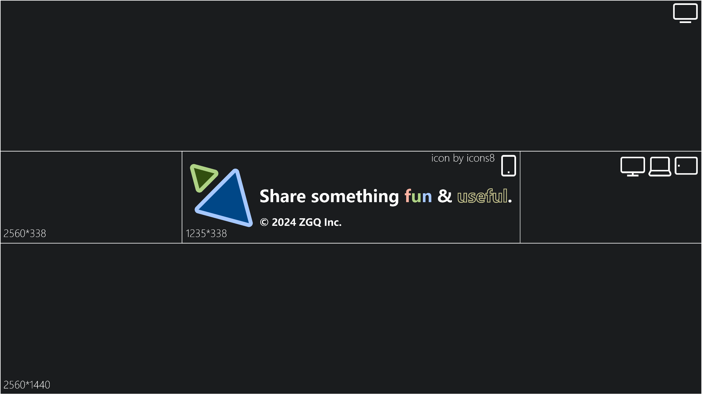

<!-- repos & tools used in this README -->
<!-- 
Adobe illustrator
https://github.com/DenverCoder1/readme-typing-svg
https://github.com/badges/shields
https://github.com/journey-ad/Moe-Counter
https://github.com/kittinan/spotify-github-profile
https://github.com/JeffreyCA/spotify-recently-played-readme
https://github.com/devicons/devicon/
https://www.pcgamebenchmark.com/
https://github.com/ZGQ-inc/skyline
https://github.com/ryo-ma/github-profile-trophy
https://github.com/yoshi389111/github-profile-3d-contrib
https://github.com/DenverCoder1/github-readme-streak-stats
https://github.com/anuraghazra/github-readme-stats
https://github.com/homarr-labs/dashboard-icons
https://github.com/gautamkrishnar/blog-post-workflow
-->

<h2 align="center">个人主页</h2>

## [domain.zgqinc.gq](http://domain.zgqinc.gq/)

<h2 align="center">联系方式</h2>

 

<h2 align="center">个人TG频道</h2>

<h2 align="center">个人博客</h2>

## 

<table width="100%">
<!-- BLOG-POST-LIST:START --><tr><td width="26%" align="center" valign="top"> 🗓️ <code>2026-09-11</code></td><td width="74%" valign="top"><a href="https://blog.zgqinc.gq/posts/9q5zb0/"><b>终结对立与私怨：SpotX + Spicetify 终极全自动兼容套件（Fusion）正式发布——跨...</b></a>  作者：ZGQ &amp;amp; Antigravity 开源仓库...</td></tr>
<tr><td width="26%" align="center" valign="top"> 🗓️ <code>2026-09-09</code></td><td width="74%" valign="top"><a href="https://blog.zgqinc.gq/posts/cze6q6/"><b>开源大赏：SpotX 与 Spicetify 的四年恩怨录——从代码互撞、已读不回，到全网黑屏的荒诞...</b></a>  作者：ZGQ &amp;amp; Antigravity 系列导航...</td></tr>
<tr><td width="26%" align="center" valign="top"> 🗓️ <code>2026-09-09</code></td><td width="74%" valign="top"><a href="https://blog.zgqinc.gq/posts/130892/"><b>梅开二度！SpotX 假修复引发 1.3.0 致命黑屏，揭秘 Spicetify 业余 Bug 与...</b></a>  作者：ZGQ &amp;amp; Antigravity 适用平台...</td></tr>
<tr><td width="26%" align="center" valign="top"> 🗓️ <code>2026-09-08</code></td><td width="74%" valign="top"><a href="https://blog.zgqinc.gq/posts/433824/"><b>终结互相甩锅！彻底解决 SpotX + Spicetify 导致的 Marketplace 消失与...</b></a>  作者：ZGQ &amp;amp; Antigravity 适用平台...</td></tr>
<tr><td width="26%" align="center" valign="top"> 🗓️ <code>2026-09-06</code></td><td width="74%" valign="top"><a href="https://blog.zgqinc.gq/posts/8xpp9h/"><b>折腾实录：Home Assistant 反向桥接 Matter 接入 SmartThings 与 G...</b></a>  📖 前情提要与折腾契机 前段时间我曾在频道里分享过利用 Matter Hub 虚拟化桥接的初步构想与踩坑记录：&lt;...</td></tr>
<!-- BLOG-POST-LIST:END -->
</table>

<h2 align="center">访客数</h2>

<h2 align="center">Spotify正在播放</h2>

|  | |
|-|-|
 | 

<h2 align="center">语言和工具</h2>

 

<h2 align="center">个人设备</h2>

| | |
|-|-|
|                                                     |     |

<h2 align="center">开发环境</h2>

<h2 align="center">正在使用</h2>

 

<h2 align="center">个人Github成就</h2>

## [查看Github Skyline](https://skyline.zgqinc.gq/)

 

<h2 align="center">我在做的项目</h2>

## [blog.zgqinc.gq/posts/projects](https://blog.zgqinc.gq/posts/projects/)
